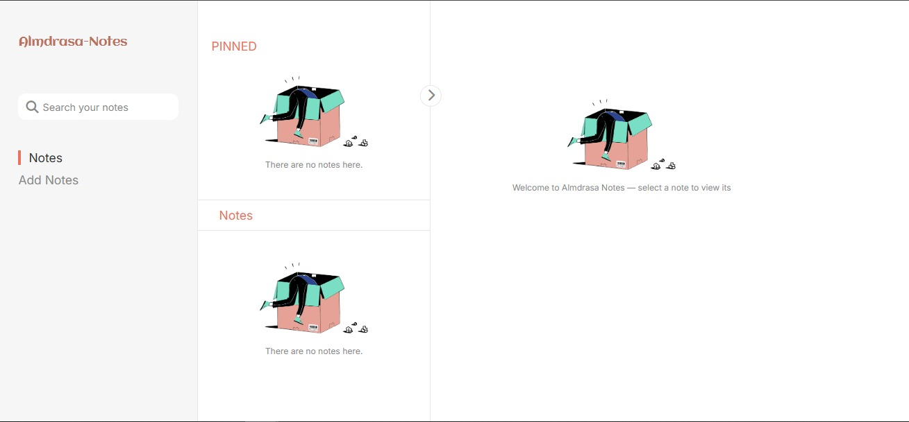

# Almdrasa-Notes



<p align="center">
  
  
  
  
  
  
  
</p>

Almdrasa-Notes is a simple and intuitive note-taking application designed to help you organize your thoughts, ideas, and important information. It allows you to create, view, and manage both regular and "pinned" notes, making it easy to keep your most crucial notes readily accessible. The application features a responsive design, adapting seamlessly to both desktop and mobile screens.

---

## 🚀 Demo

[Live Preview on Netlify](https://almadrasa-note1.netlify.app/)

---

## ✨ Features

-   **Create Notes:** Easily add new notes with a title, author, and content.
-   **Pinned Notes:** Mark important notes as "pinned" for quick access at the top.
-   **View Note Details:** Click on any note to view its full content, date, and author.
-   **Edit/Add to Notes:** Continue adding to existing notes through a dedicated "Add More" feature.
-   **Delete Notes:** Remove notes you no longer need.
-   **Search Functionality:** Quickly find your notes by searching through titles and content.
-   **Responsive Design:** Works seamlessly on desktop and mobile.
-   **Local Storage:** Your notes are saved locally in your browser.
-   **User Feedback:** Visual alerts for successful actions (e.g., note added, deleted).

---

## 🛠️ Technologies Used

-   **HTML5** — Structure of the web pages.
-   **CSS3** & **Sass** — Styling and design.
-   **TailwindCSS** — Utility-first CSS framework.
-   **JavaScript (ES6+)** — Interactivity and logic.
-   **Vite** — Fast development server and build tool.
-   **LocalStorage** — Data persistence.
-   **Google Fonts**, **Font Awesome**, **Flaticon** — Icons & Typography.

---

## 🌟 Animations

This application incorporates subtle animations to enhance the user experience and provide visual feedback:

* **Note Entry/Exit:** Notes smoothly appear and disappear when added, deleted, or filtered.
* **Sidebar Transitions:** The sidebar transitions fluidly on mobile and desktop for a polished navigation experience.
* **Interactive Elements:** Buttons and interactive elements include hover and click animations for a more engaging feel.

---

# 🏁 Getting Started

To get a local copy of this application up and running, follow these simple steps.

### Prerequisites

-   **Node.js** (which includes npm)
-   A modern web browser

---
# Clone the repository
git clone [https://github.com/amrkhaledsayed/note-app.git](https://github.com/amrkhaledsayed/note-app.git)

# Navigate to the project directory
cd note-app

# Install dependencies
npm install

# Start the development server
npm run dev

### Project Structure

Understanding the project's layout can help you navigate and contribute. Here's an overview of the key directories and files:

```plaintext
Almdrasa-Notes/
├── public/             # Publicly accessible assets.
│   └── assest/         # Images and icons used in the application.
├── styles/
│   ├── reset.css       # CSS reset stylesheet for consistent styling across browsers.
│   ├── style.scss      # Sass source file for the application's unique design.
│   └── style.css       # Compiled CSS from style.scss for the application's unique design.
├── src/
│   └── output.css      # The compiled output file from Tailwind CSS, containing all utility classes.
├── scriptes/           # JavaScript files that power the application's functionality.
│   ├── element.js      # Centralized selection of frequently used DOM elements.
│   ├── index.js        # The main entry point for the application's JavaScript logic and global event listeners.
│   ├── render-notes.js # Functions responsible for rendering notes to the UI and handling note addition logic.
│   ├── search.js       # Implements the note search functionality, including highlighting results.
│   ├── utils.js        # Provides utility functions for data management (fetching, saving, deleting) and displaying note details.
│   └── viewHandlers.js # Manages UI views, responsiveness, and various event handlers related to the user interface.
├── index.html          # The main HTML file, serving as the application's entry point.
└── README.md           # This README file, providing an overview of the project.
