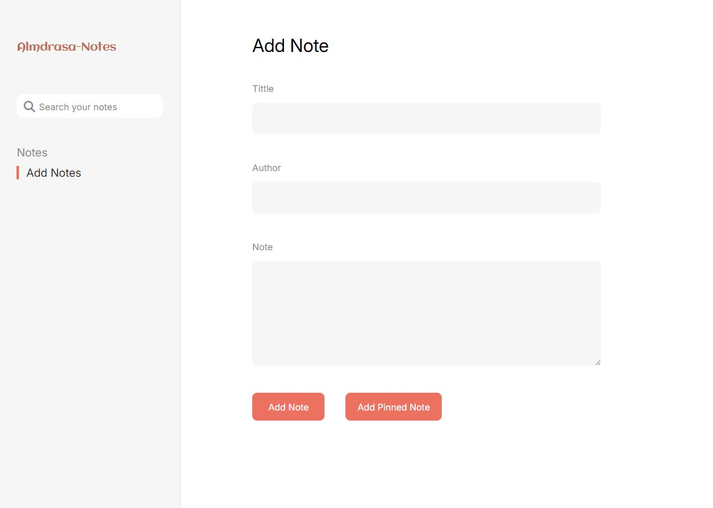
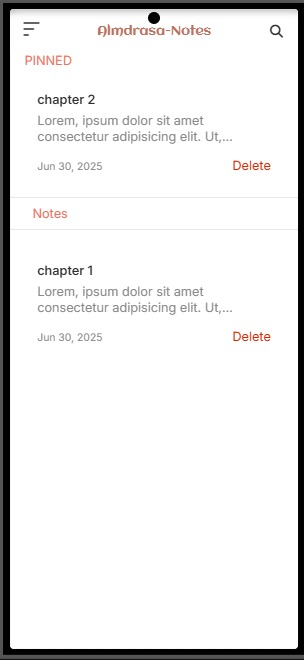

# Almdrasa-Notes






Almdrasa-Notes is a simple and intuitive note-taking application designed to help you organize your thoughts, ideas, and important information. It allows you to create, view, and manage both regular and "pinned" notes, making it easy to keep your most crucial notes readily accessible. The application features a responsive design, adapting seamlessly to both desktop and mobile screens.

---

## Features

* **Create Notes:** Easily add new notes with a title, author, and content.
* **Pinned Notes:** Mark important notes as "pinned" for quick access at the top of your list.
* **View Note Details:** Click on any note to view its full content, date, and author.
* **Edit/Add to Notes:** Continue adding to existing notes through a dedicated "Add More" feature.
* **Delete Notes:** Remove notes you no longer need.
* **Search Functionality:** Quickly find your notes by searching through titles and content.
* **Responsive Design:** Enjoy a consistent user experience across various devices, from desktops to mobile phones.
* **Local Storage:** All your notes are saved locally in your browser's storage, ensuring your data persists even after closing the application.
* **User Feedback:** Visual cues for successful actions (e.g., "Note added successfully," "Note deleted successfully").

---

## Technologies Used

* **HTML5:** For the basic structure of the web pages.
* **CSS3:** For styling and layout, including responsive design.
    * **Tailwind CSS:** Used for utility-first CSS styling (`src/output.css`).
    * **Custom CSS:** (`styles/style.css`, `styles/reset.css`) for additional styling.
* **JavaScript (ES6+):** For all interactive functionalities, including:
    * DOM manipulation.
    * Event handling.
    * Local Storage management.
    * Search algorithm.
* **Google Fonts:** For custom typography, enhancing the visual appeal.
* **Font Awesome & Flaticon:** For various icons used throughout the application.

---

## Getting Started

To get a local copy up and running, follow these simple steps.

### Prerequisites

You only need a modern web browser to run this application.

### Installation

1.  **Clone the repository:**
    ```bash
    git clone [https://github.com/YOUR_USERNAME/Almdrasa-Notes.git](https://github.com/YOUR_USERNAME/Almdrasa-Notes.git)
    ```
2.  **Navigate to the project directory:**
    ```bash
    cd Almdrasa-Notes
    ```
3.  **Open `index.html`:**
    Simply open the `index.html` file in your preferred web browser.

---

## Usage

1.  **Sidebar Navigation:**
    * **Notes:** Click "Notes" to view your list of notes (pinned and normal).
    * **Add Notes:** Click "Add Notes" to open the form for creating a new note.

2.  **Adding a Note:**
    * Go to the "Add Notes" section.
    * Fill in the **Title**, **Author**, and **Note** fields.
    * Click "Add Note" to add a regular note, or "Add Pinned Note" to add a note that will appear in the "PINNED" section.

3.  **Viewing Note Details:**
    * In the "Notes" section, click on any note card to view its full details on the right-hand side (or in a new section on mobile).

4.  **Adding More to a Note:**
    * When viewing a note's details, click the `+` icon to open a pop-up.
    * Type your additional content and click "Add" to append it to the current note.

5.  **Deleting a Note:**
    * On a note card, click the "Delete" button. You'll be asked for confirmation before the note is removed.

6.  **Searching Notes:**
    * Use the search bar in the sidebar (desktop) or header (mobile) to search for notes by title or content. The search results will highlight the matching text.

---
## 📁 Project Structure

```plaintext
Almdrasa-Notes/
├── assest/              # Contains images and icons used in the application.
├── styles/
│   ├── reset.css        # A CSS reset stylesheet to ensure consistent styling across browsers.
│   └── style.css        # Custom main stylesheet for the application's unique design.
├── src/
│   └── output.css       # The compiled output file from Tailwind CSS, containing all utility classes.
├── scriptes/            # JavaScript files that power the application's functionality.
│   ├── element.js       # Centralized selection of frequently used DOM elements.
│   ├── index.js         # The main entry point for the application's JavaScript logic and global event listeners.
│   ├── render-notes.js  # Functions responsible for rendering notes to the UI and handling note addition logic.
│   ├── search.js        # Implements the note search functionality, including highlighting results.
│   ├── utils.js         # Provides utility functions for data management (fetching, saving, deleting) and displaying note details.
│   └── viewHandlers.js  # Manages UI views, responsiveness, and various event handlers related to the user interface.
├── index.html           # The main HTML file, serving as the application's entry point.
└── README.md            # This README file, providing an overview of the project.
